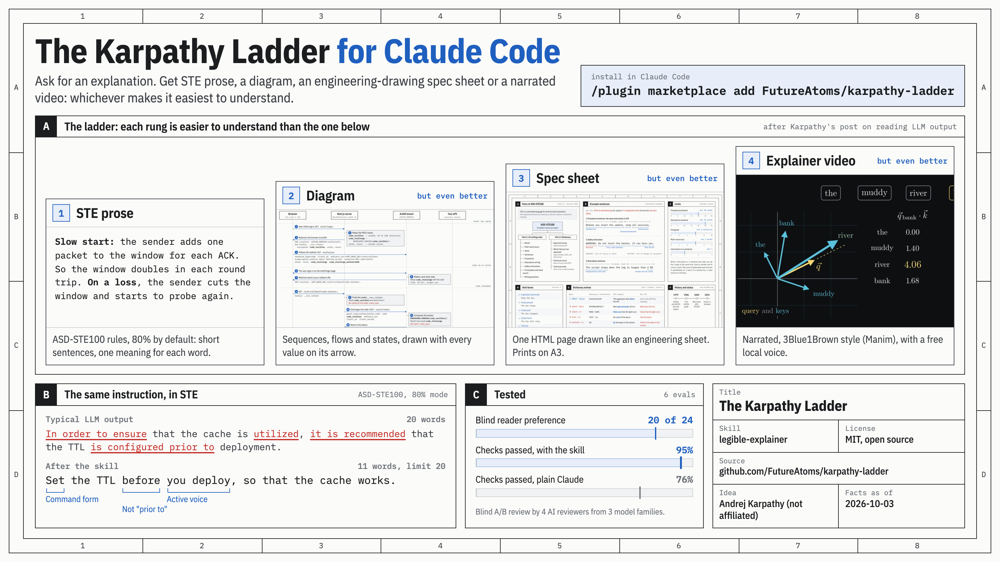

# The Karpathy Ladder

**A Claude Code skill that makes LLM output easy to understand.** Ask for an explanation and get it in the format that fits: ASD-STE100 prose, a diagram, a one-page engineering-drawing spec sheet, or a narrated 3Blue1Brown-style video.



On 2 October 2026 Andrej Karpathy [posted](https://x.com/karpathy/status/2105819303471976479) that we will spend more and more time trying to understand what language models produce, and he ranked the output formats that help most. Each one is "even better" than the last: text in ASD-STE100 (the controlled English of aircraft maintenance manuals), then diagrams, then web pages, then custom explainer videos. This repo turns that ladder into one skill that picks the right rung for each question, builds the output, and checks it before you see it.

Not affiliated with or endorsed by Andrej Karpathy.

## Install

In Claude Code:

```
/plugin marketplace add FutureAtoms/karpathy-ladder
/plugin install karpathy-ladder@karpathy-ladder
```

Or copy the skill folder by hand:

```bash
git clone https://github.com/FutureAtoms/karpathy-ladder
cp -r karpathy-ladder/skills/legible-explainer ~/.claude/skills/
```

The page checker needs Python 3 and Playwright (`pip install playwright && playwright install chromium`). The video rung also uses [Manim Community Edition](https://www.manim.community/), ffmpeg, a LaTeX install, and [kokoro-onnx](https://github.com/thewh1teagle/kokoro-onnx) for a free local voice (or ElevenLabs when `ELEVENLABS_API_KEY` is set).

## Use it

Ask the way you normally would. The skill picks the lowest rung that fully answers the question, and an explicit format request always wins.

| You ask | You get |
|---|---|
| "Explain TCP congestion control in ASD-STE100, about 80% of the way" | The answer in chat, in STE: short sentences, approved verb forms, one meaning for each word |
| "Draw the OAuth PKCE flow so I can keep it open while I debug" | A self-contained HTML page with a hand-drawn SVG sequence diagram, every value on its arrow |
| "Make a one-page overview of X I can pin next to my desk" | An engineering-drawing spec sheet in HTML, plus A4 and A3 PDFs |
| "An agent wrote this plan overnight. What does it propose and what could go wrong?" | A sheet that maps the document, checks it against itself, and leads with a verdict you can say at standup |
| "Make a 3b1b-style video on self-attention with a free local voice" | A narrated MP4 built with Manim and Kokoro, with subtitles, the script and the scene plan |

## What is inside

```
skills/legible-explainer/
  SKILL.md                      how to pick a rung, write in STE, deliver
  references/ste-writing.md     ASD-STE100 rules in plain words, the 80% / strict dial, a substitution table
  references/diagram.md         rung 2: SVG diagrams
  references/spec-sheet.md      rung 3: the drawing-sheet layout and its components
  references/video.md           rung 4: Manim or HyperFrames, voice, narration, scene plan
  assets/spec-sheet-template.html   a working sheet with every component
  scripts/ste_lint.py           STE linter: sentence limits, verb forms, passive voice, unapproved words
  scripts/check_page.py         renders at 5 widths and in print; flags overflow, collisions, tiny print type
  evals/                        the test prompts used below
examples/                       real outputs from the evaluation runs
```

Every page the skill makes opens from `file://` with no build step, and Google Fonts is its only network request. The skill also follows a house style that you can edit in `SKILL.md`: no em dashes, justified body text, no one-sided accent bars, no text squeezed into a narrow column.

## Does it work?

The skill was built with Anthropic's skill-creator loop and reviewed by four AI reviewers from three model families. As of 2026-10-03:

- **Blind reader test:** each reviewer saw the skill's output and plain Claude's output for six tasks, labelled A and B at random, and said which one a reader would understand faster. The skill won 20 of 24 comparisons.
- **Graded checks:** 95% passed with the skill, 76% without it, across the six evals (STE quality, accuracy, layout, print, delivery).
- **Cost:** about 250 s more per task than plain Claude, mostly spent on checking the page and verifying facts.

Details and the open issues are in [docs/benchmark.md](docs/benchmark.md).

## Examples

| Rung | Example |
|---|---|
| STE prose | [TCP congestion control](examples/1-ste-prose/tcp-congestion-control.md), [mutex vs semaphore](examples/1-ste-prose/mutex-vs-semaphore.md) |
| Diagram | [OAuth 2.0 + PKCE with Next.js and Auth0](examples/2-diagram-oauth-pkce/) |
| Spec sheet | [ASD-STE100 overview](examples/3-spec-sheet-ste100/) (HTML, A4 and A3 PDF), [review of an agent-written migration plan](examples/3-plan-review/) |
| Video | [Self-attention in 48 s](examples/4-video-self-attention/) (MP4, script, scene plan, Manim source) |

Open an HTML example in a browser. The sheets reflow on a phone and print on one landscape page.

## Credits

The idea and the ladder come from Andrej Karpathy's post. ASD-STE100 is maintained by the ASD Simplified Technical English Maintenance Group; the standard is free from [asd-ste100.org](https://www.asd-ste100.org). This skill paraphrases its rules and does not reproduce the standard.

MIT licensed. Made by [FutureAtoms](https://github.com/FutureAtoms).
